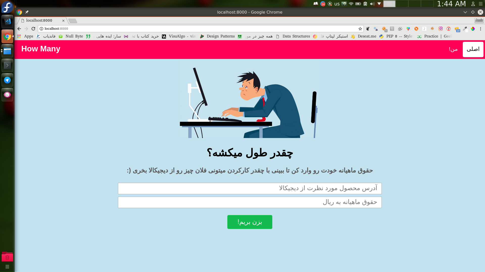
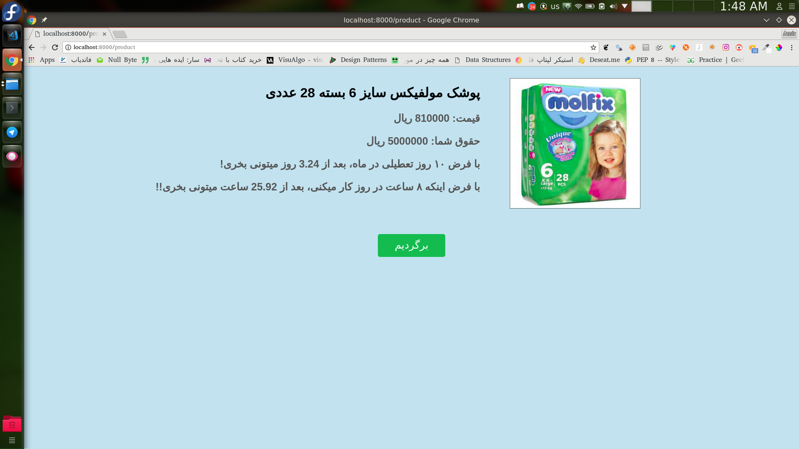

# CheGhadr?!

> Would you like to know how many hours you must work to buy sth from digikala.com

This is a simple site using python-django to calculate how many hours you must work to buy sth :)

(just for fun)




## How to use

  ```bash
  git clone https://github.com/amiremohamadi/CheGhadr && cd CheGhadr
  virtualenv .venv -p python3
  source .venv/bin/activate
  pip install -r requirements.txt
  cd CheGhadr
  python manage.py runserver 8000
  ```
  Then open your browser and go to localhost:8000

